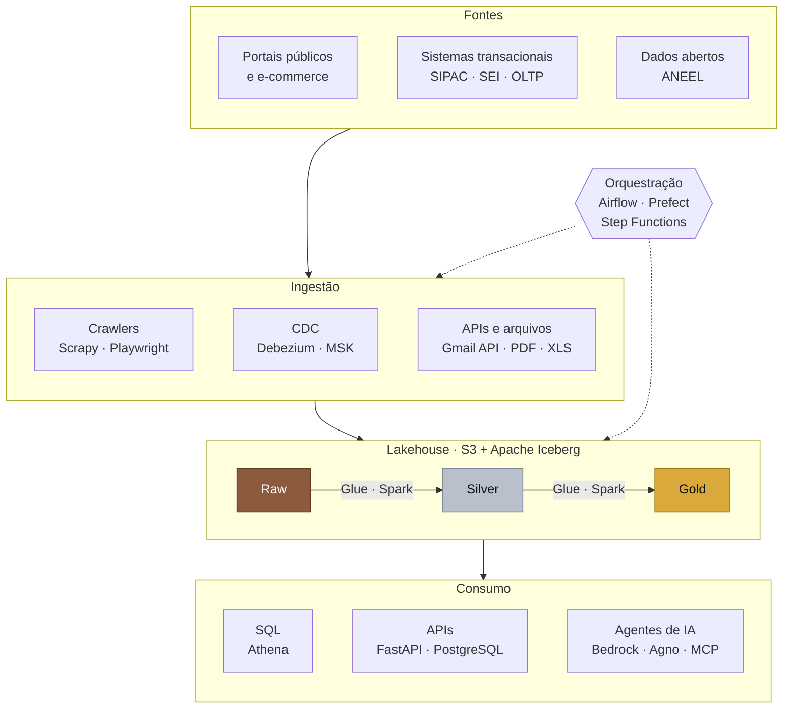

# ⚡ Luis Carmo

<a href="https://luisfcarmo.github.io/portifolio/">
  
</a>

---

<table>
  <tr>
    <td width="56%" valign="top">

### 👨‍💻 Sobre Mim

Data Platform Engineer focado em **engenharia de dados**. Construo pipelines de ponta a ponta, da coleta ao consumo por APIs e agentes de IA, com toda a infraestrutura na AWS escrita como código.

- 🔭 Hoje em três frentes: **Positivo Tecnologia**, **DIIP · PROAD/UFG** e **Enel**
- 🎓 Ciência da Computação na **UFG** (formatura prevista para 2027)
- 📍 **Goiânia, GO** · remoto ou híbrido

<a href="https://luisfcarmo.github.io/portifolio/"></a>
<a href="https://www.linkedin.com/in/luis-cesar-ferreira-do-carmo/"></a>
<a href="mailto:luiscesar@discente.ufg.br"></a>

</td>
<td width="44%" valign="middle">

```console
$ python main.py --env prod
✓ jobs orquestrados    90.000/dia
✓ airflow em produção  2+ anos
✓ autoted · ufg        em produção
✓ testes automatizados 680+
✓ lakehouse · iceberg  validated
● all systems operational
```

</td>
</tr>
</table>

---

## 🔀 Da fonte ao consumo

O fluxo que implemento nas plataformas em que trabalho, com as ferramentas de cada etapa:



**Como eu trabalho**

- **Infra 100% como código:** Terraform do bucket à fila, sem configuração manual em produção.
- **Falha visível, nunca silenciosa:** retries automáticos, alerta quando a ingestão para e registros divergentes isolados em quarentena.
- **Qualidade na entrada:** validação automática antes da carga e testes automatizados em cada etapa.
- **Auditável por padrão:** trilha imutável com hash chain SHA-256, RBAC e IAM de menor privilégio.

---

## 🏗️ Onde isso roda hoje

| | Plataforma | Destaque | Stack |
|:---|:---|:---|:---|
| **Positivo Tecnologia** | Plataforma de dados e IA: coleta em larga escala, data lake e agentes de IA | **+90k jobs/dia** sem intervenção humana | Airflow · Kubernetes/Argo · AWS Batch/Fargate · Glue · Athena · Bedrock |
| **DIIP · PROAD/UFG** | **AutoTED:** ingestão, conciliação orçamentária e auditoria dos TEDs da UFG | Em produção · **680+ testes** | Prefect · FastAPI · PostgreSQL · HTMX · Docker |
| **Enel** | Lakehouse Medallion para servir dados a agentes de IA (POC) | Raw → Silver → Gold em **Apache Iceberg** | Glue/Spark · Iceberg · Step Functions · Athena · Terraform |

---

## 🛠️ Tech Arsenal

**Engenharia de Dados & IA**

<p>
  
  
  
  
  
  
  
  
  
  
</p>

| **Linguagens** | **Backend & Web** | **Cloud & DevOps** | **Bancos & Observabilidade** |
|:---:|:---:|:---:|:---:|
|  |  |  |  |

---

<div align="center">
  📂 Projetos e trajetória completa no <a href="https://luisfcarmo.github.io/portifolio/"><b>portfólio</b></a>
  <br/><br/>
  ✨ <i>"Code is like humor. When you have to explain it, it’s bad."</i> ✨
</div>
