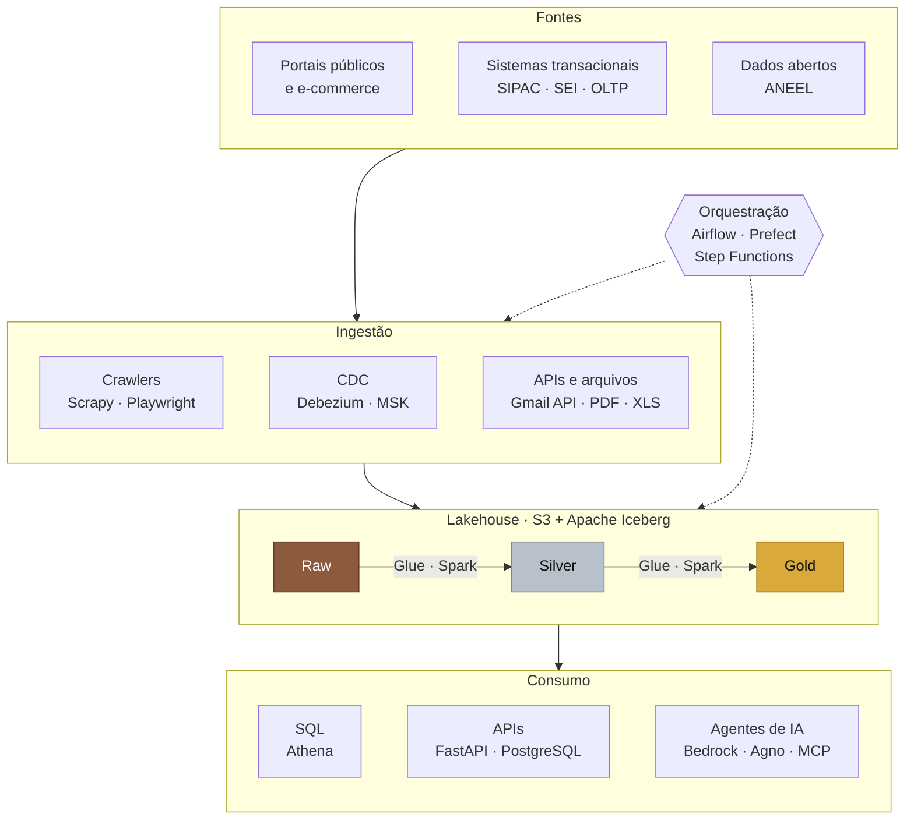

# Luis Carmo

Data Platform Engineer focado em engenharia de dados. Construo pipelines de ponta a ponta, da coleta ao consumo por APIs e agentes de IA, com a infraestrutura na AWS escrita como código.

Hoje na Positivo Tecnologia, na DIIP/UFG e na Enel. Estudante de Ciência da Computação na UFG, em Goiânia.

[Portfólio](https://luisfcarmo.github.io/portifolio/) · [LinkedIn](https://www.linkedin.com/in/luis-cesar-ferreira-do-carmo/) · [Email](mailto:luiscesar@discente.ufg.br)

## Da fonte ao consumo

## Onde isso roda hoje

| Onde | O que é | Stack |
|:---|:---|:---|
| Positivo Tecnologia | Plataforma de dados e IA com mais de 90 mil jobs por dia no Airflow | Airflow, Kubernetes/Argo, AWS Batch, Glue, Athena, Bedrock |
| DIIP · PROAD/UFG | AutoTED, sistema em produção de ingestão e conciliação orçamentária da UFG | Prefect, FastAPI, PostgreSQL, Docker |
| Enel | POC de Lakehouse Medallion para servir dados a agentes de IA | Glue/Spark, Iceberg, Step Functions, Terraform |

## Stack

| Linguagens | Backend | Cloud & DevOps | Dados & Observabilidade |
|:---:|:---:|:---:|:---:|
|  |  |  |  |

<i>"Code is like humor. When you have to explain it, it’s bad."</i>

